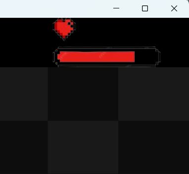

# Matching-Letter-Game
## ภาพรวมของเกม
เป็นเกมที่ผู้เล่นจะต้องพิมพ์ตามตัวอักษรที่สุ่มขึ้นมาในช่องกระดานเพื่อลบตัวอักษรนั้นบนกระดานป้องกันไม่ให้ตัวอักษรเต็มกระดาน

*ภายในเกมมีการใช้เสียงเพลงพื้นหลังประกอบการเล่น มีเอฟเฟคเสียงเมื่อพิมพ์ถูกตัวอักษร และเมื่อเลื่อนระดับของด่าน*

Background Music : [Platypus 1 OST - Comic Bakery](https://youtu.be/zY14ooABqU8?feature=shared)

Effect Sound : [8-Bit Game Sound Effects](https://youtu.be/phBBtaESoMI?feature=shared)

GameOver Sound : [Undertale OST: 068 - Death by Glamour](https://youtu.be/2TgO-tN5wAM?feature=shared)
## กฎกติกา
1. ตัวอักษร A-Z จะถูกสุ่มขึ้นมาบนกระดานขนาด 7x6 

2. ผู้เล่นจะต้องพยายามลบตัวอักษรโดยการกดปุ่มคีย์บอร์ดให้ตรงกับตัวอักษรที่ปรากฏบนกระดาน

3. ความเร็วของการสุ่มนั้นจะเพิ่มขึ้นเมื่อผู้เล่นกดตัวอักษรได้ถูกต้องตามปรากฏบนกระดานครบเป็นจำนวน 10 ครั้ง

4. เมื่อเริ่มเกมผู้เล่นจะมีเลือดอยู่ทั้งหมด 5 หน่วย และเมื่อผู้เล่นกดปุ่มคีย์บอร์ดไม่ตรงกับตัวอักษรที่ปรากฏอยู่บนกระดาน ผู้เล่นจะถูกลดเลือดลง 1 หน่วย

6. เกมจะจบลงเมื่อเลือดผู้เล่นเหลือ 0 หน่วย หรือตัวอักษรถูกสุ่มจนเต็มกระดานทุกช่อง

